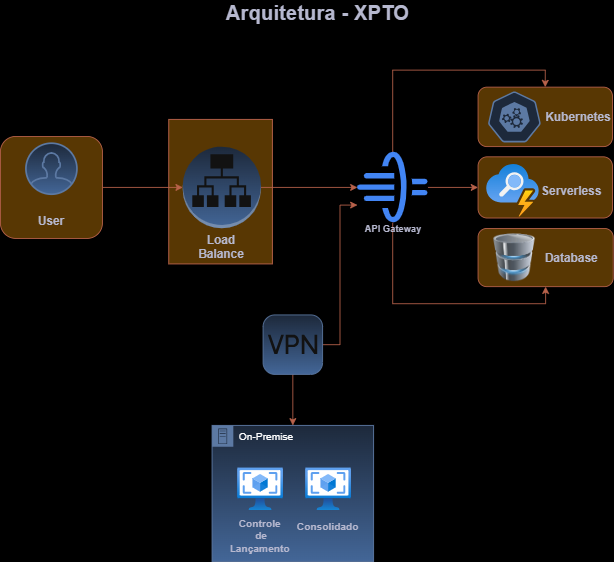

# 🏗️ Arquitetura Híbrida XPTO – Desafio Técnico

Este repositório apresenta a proposta de arquitetura híbrida desenvolvida para o cenário da empresa fictícia **XPTO**, que busca modernizar seus sistemas legados e migrar gradualmente para a nuvem, mantendo segurança, continuidade operacional e controle de custos.

---

## 📦 Estrutura da Documentação

| Arquivo                          | Descrição                                                              |
| -------------------------------- | ---------------------------------------------------------------------- |
| `01_contexto_negocio.md`         | Contexto de negócio, oportunidades e considerações sobre o legado      |
| `02_requisitos.md`               | Requisitos funcionais, não funcionais, técnicos e estratégicos         |
| `03_decisoes_arquiteturais.md`   | Decisões de design, tecnologias adotadas e estratégia para o legado    |
| `04_topologia.md`                | Visão da topologia de rede e fluxo de comunicação entre os componentes |
| `05_dimensionamento_recursos.md` | Estimativas iniciais de recursos para cada camada da solução           |
| `06_disaster_recovery.md`        | Estratégia de recuperação de desastres e continuidade de negócio       |
| `07_backup.md`                   | Políticas de backup, ferramentas e retenção                            |
| `08_observabilidade.md`          | Estratégia de logs, métricas, tracing e alertas                        |
| `09_automacao.md`                | Automação com Terraform, Ansible e CI/CD                               |
| `10_finops.md`                   | Estratégia de controle e otimização de custos (FinOps)                 |
| `11_modelo_osi.md`               | Mapeamento da solução no modelo OSI por camadas                        |
| `12_seguranca_governanca.md`     | Segurança, IAM, compliance, proteção de dados e resposta a incidentes  |

---

## 🧭 Visão Geral da Arquitetura

A arquitetura adota o modelo **híbrido consciente**, no qual:

- A **nuvem atua como ambiente principal** de execução e modernização
- O ambiente **on-premises é mantido ativamente** como contingência planejada
- Os serviços legados são avaliados para modernização (containerização, reescrita) ou migrados via **Lift and Shift (IaaS)** após um assessment técnico
- Toda a comunicação entre domínios é feita por **VPN site-to-site com criptografia IPSec**

---

## 🔐 Pilares da Solução

- **Segurança em camadas** com políticas Zero Trust, IAM, WAF, VPN e cofre de segredos
- **Observabilidade completa** com Prometheus, Grafana, ELK e tracing distribuído
- **Automação robusta** com Terraform para provisionamento e Ansible para configuração
- **Governança de custos (FinOps)** com tagging, budget alerts e rightsizing
- **Disaster Recovery** e backups planejados com testes periódicos de restauração
- **Resiliência ativa** via fallback para ambiente local (on-premises), sem downtime total
- **Pipeline CI/CD** com validação de infraestrutura, deploy seguro e testes automatizados

---

## 📊 Ferramentas Utilizadas

| Categoria       | Ferramentas                                        |
| --------------- | -------------------------------------------------- |
| Provisionamento | Terraform                                          |
| Configuração    | Ansible                                            |
| Observabilidade | Prometheus, Grafana, ELK, OpenTelemetry            |
| CI/CD           | GitHub Actions / GitLab CI                         |
| Segurança       | WAF, Vault / Secrets Manager, MFA, SAST, Trivy     |
| Backup / DR     | Snapshots, rsync, versionamento, failover manual   |
| FinOps          | CloudWatch, Azure Monitor, OpenCost, Budget Alerts |

---

## 🖼️ Diagramas Arquiteturais

### 🔷 Visão Geral da Arquitetura



---

## 📂 Organização do Projeto

```plaintext
├── 📁 diagramas/
│   ├── arquitetura.png
│   └── topologia_rede.png
│
├── 📁 docs/
│   ├── 01_contexto_negocio.md
│   ├── 02_requisitos.md
│   ├── 03_decisoes_arquiteturais.md
│   ├── 04_topologia.md
│   ├── 05_dimensionamento_recursos.md
│   ├── 06_disaster_recovery.md
│   ├── 07_backup.md
│   ├── 08_observabilidade.md
│   ├── 09_automacao.md
│   ├── 10_finops.md
│   ├── 11_modelo_osi.md
│   └── 12_seguranca_governanca.md
│
├── 📁 infra/
│   └── (estrutura reservada para códigos IaC, playbooks, etc.)
│
└── 📄 README.md
```

---

## 📜 Licença

Este projeto foi desenvolvido como parte de um desafio técnico de arquitetura de soluções e infraestrutura. Todo o conteúdo aqui apresentado — incluindo diagramas, documentos, ideias de solução e estrutura proposta — é de autoria original e protegido por direitos autorais.

O reuso, redistribuição ou adaptação parcial/total deste material só é permitido mediante autorização expressa do autor.

---

## 👨‍💻 Autor e Direitos

Arimatéia Júnior
Arquiteto de Software e Soluções | Especialista em DevOps e Cloud
📍 Caucaia, Ceará – Brasil
📧 arimateiajunior.tic@gmail.com
🔗 linkedin.com/in/arimateiajunior
