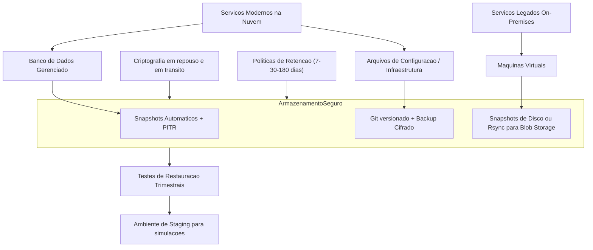

# 07 - Estratégia de Backup

Este documento descreve a estratégia de backup adotada para a arquitetura híbrida da empresa XPTO. O objetivo é garantir a **disponibilidade, integridade e recuperação dos dados** em cenários de falha, corrupção ou perda acidental, mantendo a conformidade com os objetivos de negócio e segurança da informação.

---

## 🎯 Objetivos

- Assegurar que **dados críticos possam ser restaurados** com rapidez e confiabilidade
- Manter backups alinhados com a estratégia de **Disaster Recovery (DR)**
- Estabelecer políticas claras de retenção, versionamento e testes periódicos
- Garantir a **proteção de dados em ambientes cloud e on-premises**

---

## 📦 Escopo dos Backups

| Componente                | Tipo de Backup                     | Frequência          | Armazenamento             |
| ------------------------- | ---------------------------------- | ------------------- | ------------------------- |
| Banco de dados gerenciado | Snapshots automáticos + PITR       | Diária (ret. 7-30d) | Cloud provider            |
| Serviços legados (VMs)    | Snapshots de disco + exportações   | Diária              | Armazenamento em blob     |
| Arquivos de configuração  | Git versionado + backup cifrado    | A cada alteração    | Repositório Git + Storage |
| Infraestrutura (IaC)      | Versionamento Git + exportação ZIP | Push automático     | GitHub + Storage          |

---

## 💾 Visao Geral da Estrategia de Backup (Mermaid)

---

## 🧰 Ferramentas Utilizadas

- **Cloud Provider Snapshots** (RDS, EBS, Azure Backup)
- **Terraform State remoto** (com backup automático em bucket versionado)
- **Crontabs com `rsync` + GPG** em servidores legados para replicação segura
- **Backup scripts agendados** para arquivos de aplicação, logs e configs

---

## 🛑 Políticas de Retenção

- **Curto prazo**: 7 a 15 dias (uso operacional rápido)
- **Médio prazo**: 30 dias (recuperação de incidentes)
- **Longo prazo (opcional)**: 6 meses a 1 ano (compliance e auditoria)

Todos os backups são **armazenados em local criptografado e redundante** (ex: blob storage com replicação geográfica ou cold storage).

---

## 🔐 Segurança dos Backups

- **Criptografia em trânsito e em repouso**
- **Segregação de acessos** com política least privilege (principais de serviço)
- **Armazenamento em buckets privados** com versionamento ativado
- **Validação de integridade periódica** (checksum e logs de execução)

---

## 🧪 Testes de Restauração

- Testes de restauração **devem ocorrer trimestralmente**
- Ambientes de staging podem ser usados como alvo para simulações
- Restaurações parciais e completas devem ser documentadas com tempo total de execução (para análise de RTO)

---

## 🧠 Considerações Finais

A estratégia de backup da XPTO é alinhada à sua arquitetura híbrida e garante:

- Proteção de dados críticos em múltiplos níveis
- Capacidade de resposta a incidentes de forma rápida e segura
- Conformidade com os princípios de segurança e continuidade
- Integração com ferramentas de automação e DR já definidas

O processo de backup e restauração deve evoluir com base em métricas reais, testes de falha e revisão contínua das políticas definidas.
