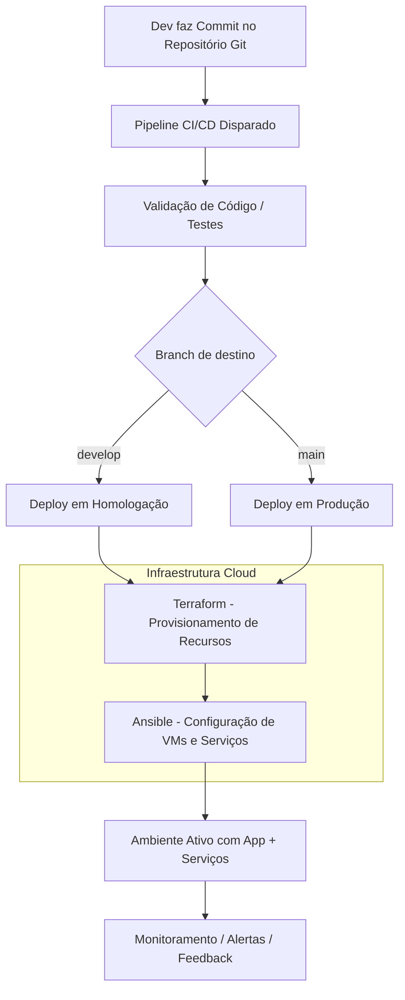

# 09 - Estratégia de Automação

Este documento descreve a estratégia de automação da arquitetura híbrida da empresa XPTO, com foco em provisionamento, configuração, deploy contínuo e consistência entre ambientes.

---

## 🎯 Objetivos da Automação

- Reduzir erros manuais e tempo de provisionamento
- Garantir **infraestrutura reprodutível e versionada**
- Suportar **múltiplos ambientes** com consistência (dev, staging, produção)
- Acelerar o ciclo de entrega com integração e deploy contínuos

---

## ⚙️ Camadas de Automação

| Camada                           | Ferramenta / Abordagem                   | Objetivo                                |
| -------------------------------- | ---------------------------------------- | --------------------------------------- |
| Provisionamento                  | Terraform                                | Criar e gerenciar recursos cloud        |
| Configuração                     | Ansible                                  | Configurar VMs, serviços e arquivos     |
| Deploy de aplicação              | Pipelines CI/CD (GitHub Actions, GitLab) | Entregar código e assets com segurança  |
| Infraestrutura como Código (IaC) | Git versionado                           | Histórico e rastreabilidade de mudanças |

---

## 🧱 1. Provisionamento com Terraform

O Terraform será usado para provisionar:

- Redes (VPCs, subnets, rotas)
- Recursos computacionais (Kubernetes, VMs, Serverless)
- Armazenamento (buckets, bancos de dados, snapshots)
- VPNs e regras de segurança

### 🧠 Boas práticas adotadas

- Uso de módulos reutilizáveis
- Backend remoto com lock (ex: S3 + DynamoDB, Azure Storage)
- Variáveis externas por ambiente (`dev.tfvars`, `prod.tfvars`)
- Versionamento no Git e revisão via Merge Request

---

## 🛠️ 2. Configuração com Ansible

O Ansible será usado para:

- Instalação de pacotes em VMs legadas ou provisionadas
- Configuração de serviços, arquivos, permissões
- Injeção de secrets, environment vars e monitoração
- Execução remota via SSH com controle por inventário

### 🧠 Boas práticas adotadas

- Roles reutilizáveis e idempotentes
- Templates com `Jinja2` para arquivos dinâmicos
- Execução manual ou via pipeline (Ansible-Pull/Runner)

---

## 🚀 3. Deploy Contínuo (CI/CD)

Um pipeline CI/CD será responsável por:

- Rodar testes automatizados (unitários, lint, security scan)
- Gerar artefatos (ex: build do frontend com Vite, imagens Docker)
- Fazer deploy nos ambientes correspondentes (homologação → produção)
- Executar pós-deploys (migrar banco, limpar cache, healthcheck)

---

## 🧪 4. Testes Automatizados e Auditoria

- Lint e validação de sintaxe para Terraform e Ansible
- Testes de infraestrutura com terraform plan, tflint, checkov
- Testes de idempotência e validação com Ansible Molecule
- Auditoria de mudanças via Git e comentários de pipeline

---

## 🔄 5. Ciclo de Atualização

Toda mudança deve seguir o seguinte fluxo:

```plaintext
Planejamento → Commit → Merge Request → CI/CD → Deploy automático → Monitoramento
```

- Rollback automático em caso de falha no healthcheck
- Ambientes atualizados de forma previsível e auditável
- Possibilidade de blue-green deploy ou canary release em fases futuras

---

## 🧭 Diagrama da Estratégia de Automação (Mermaid)



---

## 📌 Conclusão

A estratégia de automação da XPTO:

- Garante consistência entre ambientes
- Reduz riscos operacionais
- Aumenta a velocidade de entrega com confiança
- Prepara a infraestrutura para escalar com segurança e controle

Essa base sólida permite evoluir para DevSecOps, autoscaling inteligente e integração com ferramentas de FinOps e observabilidade.
