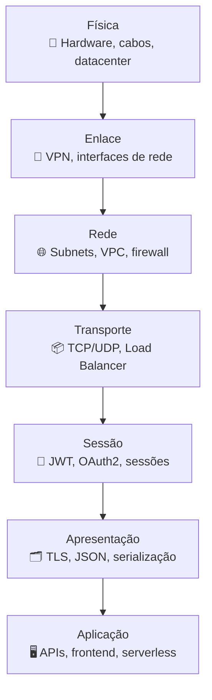

# 11 - Mapeamento da Arquitetura no Modelo OSI

Este documento apresenta uma visão de como os principais componentes da arquitetura híbrida da empresa XPTO se relacionam com as camadas do **modelo OSI** (Open Systems Interconnection), utilizado como referência para comunicação em redes.

---

## 🌐 Visão Geral

O modelo OSI é composto por **7 camadas** que representam os diferentes níveis de abstração na comunicação de dados entre sistemas distribuídos. Ao mapear os serviços da arquitetura híbrida sobre esse modelo, podemos entender melhor **onde aplicar segurança, observabilidade e controle de tráfego**.

---

## 🧱 Mapeamento por Camada

| Camada OSI (de cima para baixo) | Papel na arquitetura XPTO                            | Exemplos na solução                                          |
| ------------------------------- | ---------------------------------------------------- | ------------------------------------------------------------ |
| 7. Aplicação                    | Interface com o usuário e comunicação com APIs       | Frontend Web, REST APIs, Gateway, funções serverless         |
| 6. Apresentação                 | Conversão e formatação de dados                      | JSON, criptografia TLS, codificação UTF-8, serialização      |
| 5. Sessão                       | Estabelecimento e controle de sessões de comunicação | JWT, OAuth2, sessões de autenticação, WebSocket              |
| 4. Transporte                   | Garantia de entrega e controle de fluxo              | TCP/UDP, controle de portas, balanceamento de carga          |
| 3. Rede                         | Roteamento e endereçamento IP                        | Subnets, VPCs, rotas, firewalls, NAT Gateways                |
| 2. Enlace                       | Comunicação entre dispositivos locais                | Interfaces de rede, VPNs site-to-site, MAC filtering         |
| 1. Física                       | Transmissão de bits por meio de hardware             | Equipamentos on-premises, infraestrutura cloud (física/host) |

---

## 🔐 Aplicações Práticas por Camada

| Camada | Aplicação prática na arquitetura                         |
| ------ | -------------------------------------------------------- |
| 7      | Autenticação de usuários e controle de APIs              |
| 6      | Criptografia TLS, segurança de payloads                  |
| 5      | Sessões seguras com timeout e tokens                     |
| 4      | Balanceadores de carga, healthchecks                     |
| 3      | Regras de firewall, segmentação de redes                 |
| 2      | VPN com IPSec, controle de interfaces                    |
| 1      | Conectividade física local + nuvem, redundância de links |

---

## 🔎 Observabilidade e Segurança

O entendimento por camadas permite aplicar **controles direcionados** de:

- **Logs e métricas** específicos (ex: métricas L4 em Load Balancer, logs de API L7)
- **Controles de acesso e WAF** no nível de aplicação
- **Monitoramento de VPN e tráfego IP** nas camadas de rede e enlace
- **Mitigações de falhas físicas ou de link** no nível 1

---

## 🧭 Diagrama OSI com componentes da XPTO (Mermaid)

---

## 📌 Conclusão

O mapeamento da arquitetura sobre o modelo OSI permite:

- Visualizar com clareza os **pontos de controle e segurança**
- Aplicar técnicas de **observabilidade por camada**
- Guiar decisões de infraestrutura e arquitetura de forma mais estruturada
- Facilitar o diálogo entre times de **rede, segurança e desenvolvimento**

Esse modelo será usado como base de referência para aprofundar camadas específicas em auditorias, troubleshooting e evolução futura da solução.
